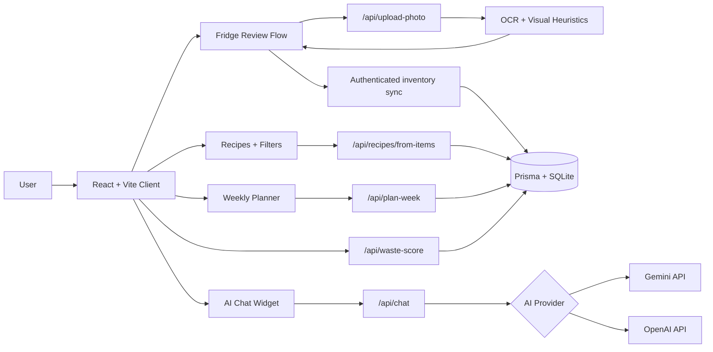

# WasteNotChef
live URL: https://waste-not-chef.vercel.app

WasteNotChef is an AI-powered fridge intelligence app that turns ingredients on hand into recipes, weekly meal plans, and lower-waste cooking decisions.

Live app: [https://waste-not-chef.vercel.app](https://waste-not-chef.vercel.app)

## What It Does
- Upload a fridge photo with a camera-first flow
- Detect visible ingredients using image recognition when configured, with OCR label reading as fallback
- Let users manually correct or add missing pantry items
- Generate recipe suggestions from the latest fridge state
- Filter recipes by `All`, `Country`, and `Continent`
- Prioritize a broader set of Indian recipes and pantry-relevant matches
- Add recipes to a weekly planner for later
- Open recipes inline for step-by-step cooking right away
- Chat with an in-app AI assistant powered by Gemini or OpenAI

## Why I Built It
I built WasteNotChef to solve a very common problem: people already have food at home, but they still do not know what to cook first, what is about to go bad, or how to turn random fridge items into a plan. The product combines fridge scanning, pantry correction, recipe generation, planning, and AI assistance into one focused experience.

## Product Highlights
- React + Vite + TypeScript frontend with Tailwind and Framer Motion
- Express + TypeScript backend with Prisma + SQLite
- Fridge photo recognition with editable results and clearly labeled default expiry estimates
- Quest-style planner UX with drag and drop day cards
- Editable pantry items with Remove/Undo, local guest storage, and account inventory sync
- Notification preferences UI with browser permission support
- Deploy-ready setup for Vercel + Render

## Feature Overview
| Feature | What it does |
| --- | --- |
| Camera-first fridge scan | Upload a fridge photo and extract likely ingredients from OCR plus visual heuristics |
| Manual pantry correction | Add missing items, fix expiry dates, and keep the inventory accurate |
| Fresh recipe generation | Generate recipes from the latest fridge state with a dedicated `Get Recipes` action |
| Geography filters | Browse recipes by `All`, `Country`, and `Continent` |
| Indian recipe depth | Surface more Indian breakfasts, curries, sabzis, rice dishes, dals, and snacks |
| Weekly planner | Save recipes for later and organize them in a quest-style planner |
| Cook-now recipe view | Open steps and a related YouTube search directly inside the recipe card |
| AI chat | Ask Gemini or OpenAI-powered questions about recipes, substitutions, storage, or planning |

## Tech Stack
- Client: React, Vite, TypeScript, Tailwind CSS, Framer Motion
- Server: Node.js, Express, TypeScript
- Database: Prisma, SQLite
- OCR: Tesseract.js
- Scheduling: deterministic EDF-style weekly planning
- Notifications: browser permission flow, backend reminder stubs
- AI chat: Gemini or OpenAI through a backend proxy route

## Architecture

## Quick Start
1. Copy `.env.example` to `.env`
2. Copy `client/.env.example` to `client/.env`
3. Install dependencies
   - `npm install`
   - `npm install --prefix client`
4. Set up the database
   - `npx prisma migrate dev --name init`
   - `npm run prisma:seed`
5. Start the app
   - `npm run dev`
6. Open `http://localhost:5173`

## Useful Commands
- `npm run dev` starts server and client together
- `npm run build` builds server and client
- `npm test` runs the test suite
- `npm run prisma:seed` reseeds ingredients and recipes

## AI Chat Setup
The app includes an in-product AI chat widget.

Use Gemini:
- `AI_PROVIDER=gemini`
- `GEMINI_API_KEY=your_key_here`
- optional `GEMINI_MODEL=gemini-2.5-flash`

Use OpenAI:
- `AI_PROVIDER=openai`
- `OPENAI_API_KEY=your_key_here`
- optional `OPENAI_MODEL=gpt-4.1-mini`

The AI provider key should be added only on the backend deployment, not in the client.

## Deployment
Recommended:
- Frontend on Vercel
- Backend on Render

### Render
- Deploy the repo root
- Build command:
  - `npm install && npx prisma generate && npm run build:server`
- Start command:
  - `npx prisma db push && npm run prisma:seed && node dist/src/index.js`
- Required env:
  - `DATABASE_URL=file:./prisma/dev.db`
  - `CLIENT_URLS=https://your-vercel-url.vercel.app`
- For AI chat with Gemini:
  - `AI_PROVIDER=gemini`
  - `GEMINI_API_KEY=...`
  - `GEMINI_MODEL=gemini-2.5-flash`

### Vercel
- Set project root to `client`
- Add:
  - `VITE_API_BASE_URL=https://your-render-url.onrender.com/api`

## Current UX Flow
1. Create an account, sign in, or continue as guest
2. Upload a fridge image or grocery receipt
3. Review detected items and manually add anything missing
4. Click `Get Recipes` to generate fresh recommendations from the latest fridge items
5. Use `Show recipe` to cook now or `Add to plan` to save it for later
6. Adjust the weekly planner and ask the AI chat for help with substitutions, recipes, or storage

## Demo Notes
- `Show recipe` is for cooking immediately
- `Add to plan` is for saving recipes into the planner for later
- Manual pantry additions persist across refresh
- Recipe generation always uses the latest fridge state when `Get Recipes` is clicked

## Limitations
- Fridge photos use Gemini image recognition when a backend key is configured; if unavailable, label reading is used and the app says so. Unlabeled or obscured items can still be missed.
- Expiry dates are usually inferred unless readable packaging text is visible
- SQLite is fine for demos and lightweight usage, but Postgres would be better for scale

## Next Improvements
- Improve recognition coverage with more real-world fridge-photo fixtures
- Add shopping list generation from missing recipe ingredients
- Add shared household mode and collaborative planning
- Add saved recipes and scan history
- Add streaming AI chat responses and richer pantry-aware tool use

## Receipt scanning
- Open **Fridge → Upload receipt** and choose a JPEG, PNG, or WebP photo/screenshot (maximum 10 MB).
- `POST /api/upload-receipt` accepts multipart field `image` and returns recognized food items. The client merges them with existing inventory and saves through the authenticated inventory endpoint or guest storage.
- Household/pet products, discounts, totals, and payment lines are excluded. The parser handles common store abbreviations, separate price lines, and conservative OCR spelling corrections. Image rotation, contrast enhancement, and sharpening help with mildly blurry photos; unreadable text can still be missed. Review names, quantities, and dates after scanning.
- Receipt dates are never treated as expiry dates. Where available, shelf-life rules estimate expiry from the upload date; check the packaging.
- The same image bytes produce stable item IDs, so retries do not create duplicates. A different photograph of the same receipt is considered a new receipt.
- No matches leaves inventory unchanged. OCR/API failures show an error. Temporary receipt images are deleted after processing, and the browser retains its inventory across refreshes.

## Accounts and inventory sync
- Register with an email address and a password of at least 12 characters. Save the recovery code shown once after registration. Password recovery uses that code, rotates it, and signs out existing sessions; reset emails are not sent.
- Passwords use salted scrypt hashes. Random bearer sessions are hashed in the database, expire after 30 days, and are revoked on sign-out. The browser keeps its token in session storage; use HTTPS in production.
- Signed-in inventories are stored per user. Sign in on another device to load the same pantry. Saves use version checks; if another device changed the inventory, refresh and reapply the edit. Inventory refreshes on window focus when an editor is not active, or with **Refresh pantry**.
- Guest inventories remain on the device. After signing in, choose **Import pantry from this device** to copy existing items to the account. Old shared backend records are not assigned to any account or exposed through waste history.
- Apply the additive schema changes with `npx prisma db push` and regenerate the Prisma client. Render's documented start command already applies them. Keep SQLite on a persistent disk and retain backups; never reset the database during deployment.
- Account creation and scans have request limits. For multiple server instances, use a shared rate-limit store and a database suited to concurrent writes.
- Run `npx vitest run test/accounts.test.ts test/receipt.test.ts test/receipt-route.test.ts` for account isolation, recovery, inventory conflicts, and receipt coverage. Set `REAL_OCR_TEST=1` and run `npx vitest run test/receipt-image.test.ts` for a real blurred-image OCR check; its first run downloads the English language model.

## Default dates
- Manual entries, receipt results, fridge-photo results, and previously undated pantry items share the same date rules. Explicit dates always win. Estimates are saved once and do not move forward on refresh; editing a food name recalculates its estimate from its original added date.
- Examples: ripe refrigerated tomatoes use 2 days; raw eggs in shells use 21 days; raw chicken uses 2 days; cooked leftovers use 3 days. These are planning estimates from the added date, assuming recently purchased/prepared food and the stated storage conditions. Adjust for earlier purchases, opening, ripeness, and package instructions; an estimate cannot establish that food is safe.
- Preparation matters: `dry rice` uses a pantry estimate, while `cooked rice` uses a short refrigerated estimate. Unknown names receive a next-day **Review by** reminder, not a claimed shelf life.
- Defaults use conservative planning values informed by [FoodSafety.gov cold storage guidance](https://www.foodsafety.gov/food-safety-charts/cold-food-storage-charts) and [Nebraska Extension home food storage guidance](https://food.unl.edu/free-resource/food-storage/). The card displays the storage assumption and allows corrections.
- Automatic email/push reminder delivery is not connected. Settings makes this explicit. Planner scores are estimates of pantry use, not measured waste avoided. Inventory syncs across accounts' devices; recipe and planner views are cached on the current device/session.
